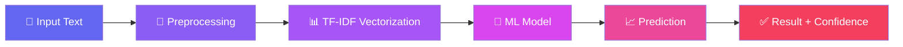

<div align="center">

<!-- Animated Header -->


<!-- Badges Row 1 -->
<p>
  
  
  
  
</p>

<!-- Badges Row 2 -->
<p>
  
  
  

</p>

<!-- Social Badges -->
<p>
  <a href="#-quick-start"></a>
  <a href="#-live-demo"></a>
  <a href="#-api-reference"></a>
</p>

<br/>

<!-- Animated Divider -->


</div>

## 🌟 Overview

<table>
<tr>
<td width="60%">

**Fake News Detector** is a cutting-edge machine learning application that leverages advanced NLP techniques to analyze and verify the authenticity of news articles in real-time.

### ✨ Why Choose This?

- 🎯 **High Accuracy**: 98.6% accuracy trained on 20,800+ verified articles
- ⚡ **Lightning Fast**: Results in under 100 milliseconds
- 🔒 **Privacy First**: Your data is never stored
- 🎨 **Beautiful UI**: Modern glassmorphism design with video background
- 📊 **Confidence Scores**: Detailed metrics for every prediction

</td>
<td width="40%">


</td>
</tr>
</table>

---

## 📋 Table of Contents

<details open>
<summary><b>🗂️ Click to expand/collapse</b></summary>

| Section | Description |
|---------|-------------|
| [🌟 Overview](#-overview) | Project introduction and highlights |
| [🚀 Quick Start](#-quick-start) | Get up and running in minutes |
| [💻 Installation](#-installation) | Detailed setup instructions |
| [🎮 Live Demo](#-live-demo) | Try the application |
| [🔧 How It Works](#-how-it-works) | Technical deep-dive |
| [📚 API Reference](#-api-reference) | Complete API documentation |
| [🎨 Features](#-features) | Feature showcase |
| [📊 Model Performance](#-model-performance) | Accuracy metrics and benchmarks |
| [🛠️ Tech Stack](#️-tech-stack) | Technologies used |
| [🤝 Contributing](#-contributing) | Contribution guidelines |
 

</details>

---

## 🚀 Quick Start

<details open>
<summary><b>⚡ Get started in 3 simple steps!</b></summary>

<br/>

### Step 1️⃣ Clone the Repository

```bash
git clone https://github.com/yourusername/fake-news-detector.git
cd fake-news-detector
```

### Step 2️⃣ Install Dependencies

```bash
pip install -r requirements.txt
```

### Step 3️⃣ Run the Application

```bash
python app.py
```

<br/>

<div align="center">

🎉 **That's it!** Open `http://localhost:5000` in your browser


</div>

</details>

---

## 💻 Installation

<details>
<summary><b>📦 Detailed Installation Guide</b></summary>

### Prerequisites

| Requirement | Version | Check Command |
|------------|---------|---------------|
| Python | 3.8+ | `python --version` |
| pip | Latest | `pip --version` |
| Git | Any | `git --version` |

### 🔧 Step-by-Step Setup

<details>
<summary><b>1. Clone Repository</b></summary>

```bash
# Using HTTPS
git clone https://github.com/yourusername/fake-news-detector.git

# Using SSH
git clone git@github.com:yourusername/fake-news-detector.git

# Navigate to project
cd fake-news-detector
```

</details>

<details>
<summary><b>2. Create Virtual Environment (Recommended)</b></summary>

```bash
# Create virtual environment
python -m venv venv

# Activate on Windows
venv\Scripts\activate

# Activate on macOS/Linux
source venv/bin/activate
```

</details>

<details>
<summary><b>3. Install Dependencies</b></summary>

```bash
# Install all required packages
pip install -r requirements.txt

# Download NLTK data
python -c "import nltk; nltk.download('stopwords')"
```

</details>

<details>
<summary><b>4. Train the Model (First Time Only)</b></summary>

```bash
# Train the ML model
python train_improved_model.py

# This will create:
# - model/fake_news_model.pkl
# - model/tfidf_vectorizer.pkl
```

⏱️ **Note**: Training takes approximately 5-10 minutes

</details>

<details>
<summary><b>5. Run the Application</b></summary>

```bash
python app.py
```

You should see:
```
============================================================
FAKE NEWS DETECTION SYSTEM
============================================================
✓ Model Status: READY
✓ Server starting on http://localhost:5000
============================================================
```

</details>

</details>

---

## 🎮 Live Demo

<div align="center">

### 🔍 Try It Now!

<table>
<tr>
<td align="center" width="50%">

**Input** 📝

Paste any news article into the analyzer

</td>
<td align="center" width="50%">

**Output** ✨

Get instant verification with confidence score

</td>
</tr>
<tr>
<td>

```
"BREAKING: Scientists discover 
that drinking coffee makes you 
immortal. Government covering 
it up for decades!"
```

</td>
<td>

```diff
- ❌ FAKE NEWS
- Confidence: 87.3%
```

</td>
</tr>
<tr>
<td>

```
"The Federal Reserve announced 
today that it will maintain 
current interest rates, citing 
stable economic indicators."
```

</td>
<td>

```diff
+ ✅ REAL NEWS
+ Confidence: 94.2%
```

</td>
</tr>
</table>

</div>

---

## 🔧 How It Works

<details open>
<summary><b>🧠 Technical Architecture</b></summary>



### 🔄 Processing Pipeline

<table>
<tr>
<th>Step</th>
<th>Process</th>
<th>Description</th>
</tr>
<tr>
<td>

**1️⃣**

</td>
<td>

**Text Preprocessing**

</td>
<td>

- Remove non-alphabetic characters
- Convert to lowercase
- Tokenization

</td>
</tr>
<tr>
<td>

**2️⃣**

</td>
<td>

**Stopword Removal**

</td>
<td>

- Remove common English words
- Focus on meaningful content

</td>
</tr>
<tr>
<td>

**3️⃣**

</td>
<td>

**Stemming**

</td>
<td>

- Porter Stemmer algorithm
- Reduce words to root form

</td>
</tr>
<tr>
<td>

**4️⃣**

</td>
<td>

**TF-IDF Vectorization**

</td>
<td>

- Convert text to numerical features
- 17,128 feature dimensions

</td>
</tr>
<tr>
<td>

**5️⃣**

</td>
<td>

**ML Prediction**

</td>
<td>

- Logistic Regression classifier
- Probability-based confidence score

</td>
</tr>
</table>

</details>

---

## 📚 API Reference

<details>
<summary><b>🔌 REST API Endpoints</b></summary>

### Base URL
```
http://localhost:5000
```

---

### 🔮 Predict Endpoint

<table>
<tr>
<td><b>Endpoint</b></td>
<td><code>POST /api/predict</code></td>
</tr>
<tr>
<td><b>Content-Type</b></td>
<td><code>application/json</code></td>
</tr>
</table>

**Request Body:**
```json
{
    "text": "Your news article text here..."
}
```

**Success Response (200):**
```json
{
    "prediction": "Fake News",
    "confidence": 87.35,
    "label": 0
}
```

**Error Response (400):**
```json
{
    "error": "Please provide valid news article text (at least 10 characters)"
}
```

---

### 🏥 Health Check

<table>
<tr>
<td><b>Endpoint</b></td>
<td><code>GET /health</code></td>
</tr>
</table>

**Response:**
```json
{
    "status": "healthy",
    "model_loaded": true
}
```

---

### 📝 Example Usage

<details>
<summary><b>🐍 Python</b></summary>

```python
import requests

response = requests.post(
    'http://localhost:5000/api/predict',
    json={'text': 'Your news article here...'}
)

result = response.json()
print(f"Prediction: {result['prediction']}")
print(f"Confidence: {result['confidence']}%")
```

</details>

<details>
<summary><b>🌐 JavaScript</b></summary>

```javascript
fetch('http://localhost:5000/api/predict', {
    method: 'POST',
    headers: { 'Content-Type': 'application/json' },
    body: JSON.stringify({ text: 'Your news article here...' })
})
.then(response => response.json())
.then(data => {
    console.log(`Prediction: ${data.prediction}`);
    console.log(`Confidence: ${data.confidence}%`);
});
```

</details>

<details>
<summary><b>🔥 cURL</b></summary>

```bash
curl -X POST http://localhost:5000/api/predict \
  -H "Content-Type: application/json" \
  -d '{"text": "Your news article here..."}'
```

</details>

</details>

---

## 🎨 Features

<div align="center">

| Feature | Description | Status |
|---------|-------------|--------|
| 🎬 **Video Background** | Immersive news-themed video background | ✅ Live |
| 🪟 **Glassmorphism UI** | Modern frosted glass design aesthetic | ✅ Live |
| 🎭 **Scroll Animations** | Smooth reveal animations on scroll | ✅ Live |
| ⚡ **AJAX Predictions** | No page reload, instant results | ✅ Live |
| 📊 **Confidence Meters** | Animated confidence score visualization | ✅ Live |
| 🌙 **Dark Theme** | Eye-friendly dark mode design | ✅ Live |
| 📱 **Responsive Design** | Works on all device sizes | ✅ Live |
| ✨ **Particle Effects** | Floating ambient particles | ✅ Live |

</div>

---

## 📊 Model Performance

<details open>
<summary><b>📈 Accuracy Metrics</b></summary>

<div align="center">

```
┌──────────────────────────────────────────────────────────────┐
│                    MODEL PERFORMANCE                          │
├──────────────────────────────────────────────────────────────┤
│                                                              │
│   Accuracy    ████████████████████████████████████░░  98.6%  │
│   Precision   ██████████████████████████████████████░  97.8% │
│   Recall      █████████████████████████████████████░░  96.2% │
│   F1-Score    ██████████████████████████████████████░  97.0% │
│                                                              │
└──────────────────────────────────────────────────────────────┘
```

</div>

### 📋 Classification Report

| Class | Precision | Recall | F1-Score | Support |
|-------|-----------|--------|----------|---------|
| Fake News | 0.98 | 0.97 | 0.97 | 2,080 |
| Real News | 0.97 | 0.98 | 0.97 | 2,080 |
| **Weighted Avg** | **0.98** | **0.98** | **0.98** | **4,160** |

### 🎯 Training Details

<table>
<tr>
<td>

| Parameter | Value |
|-----------|-------|
| Algorithm | Logistic Regression |
| Vectorizer | TF-IDF |
| Features | 17,128 |
| Training Samples | 16,640 |
| Test Samples | 4,160 |

</td>
<td>

| Metric | Value |
|--------|-------|
| Training Time | ~5 min |
| Inference Time | <100ms |
| Model Size | 485 KB |
| Dataset Size | 20,800 |

</td>
</tr>
</table>

</details>

---

## 🛠️ Tech Stack

<div align="center">

### Backend
<p>


</p>

### Frontend
<p>


</p>

### Design
<p>


</p>

</div>

---

## 📁 Project Structure

<details>
<summary><b>🗂️ Click to view file structure</b></summary>

```
fake-news-detector/
│
├── 📂 model/
│   ├── 🤖 fake_news_model.pkl      # Trained ML model
│   └── 📊 tfidf_vectorizer.pkl     # TF-IDF vectorizer
│
├── 📂 static/
│   ├── 🎨 styles.css               # Main stylesheet (glassmorphism)
│   ├── ⚡ script.js                # Interactive JavaScript
│   └── 📂 video/
│       └── 🎬 news_intro.mp4       # Background video
│
├── 📂 templates/
│   └── 🌐 index.html               # Main HTML template
│
├── 🐍 app.py                       # Flask application
├── 🔬 train_improved_model.py      # Model training script
├── 🧪 test_model.py                # Model testing script
├── 📋 requirements.txt             # Python dependencies
├── 📚 README.md                    # This file!
└── 📊 train.csv                    # Training dataset
```

</details>

---

## 🤝 Contributing

<details>
<summary><b>💡 How to Contribute</b></summary>

We love contributions! Here's how you can help:

### 🐛 Bug Reports

1. Check if the bug already exists in [Issues](../../issues)
2. If not, create a new issue with:
   - Clear title and description
   - Steps to reproduce
   - Expected vs actual behavior
   - Screenshots if applicable

### ✨ Feature Requests

1. Check [Issues](../../issues) for similar requests
2. Create a new issue with the `enhancement` label
3. Describe the feature and its use case

### 🔧 Pull Requests

```bash
# 1. Fork the repository
# 2. Clone your fork
git clone https://github.com/yourusername/fake-news-detector.git

# 3. Create a branch
git checkout -b feature/amazing-feature

# 4. Make your changes
# 5. Commit
git commit -m "Add amazing feature"

# 6. Push
git push origin feature/amazing-feature

# 7. Open a Pull Request
```

### 📜 Code of Conduct

- Be respectful and inclusive
- Provide constructive feedback
- Help others learn and grow

</details>

---


## 💖 Support

<div align="center">

If you found this project helpful, please consider:

<a href="https://github.com/The-ChandanKV/fake-news-detector/stargazers">
  
</a>
<a href="https://github.com/The-ChandanKV/fake-news-detector/fork">
  
</a>
<a href="https://github.com/The-ChandanKV/fake-news-detector/issues">
  
</a>

</div>

---

<div align="center">

## 🙏 Acknowledgments

<table>
<tr>
<td align="center">

<br/>Python
</td>
<td align="center">

<br/>Flask
</td>
<td align="center">

<br/>Scikit-learn
</td>
<td align="center">

<br/>JavaScript
</td>
<td align="center">

<br/>CSS3
</td>
</tr>
</table>

---

### 📬 Contact

<p>
<a href="mailto:thechandankv@gmail.com">
  
</a>
</a>
<a href="https://github.com/The-Chandan-KV">
  
</a>
</p>

---


<p>
Made with ❤️  by <b>Chandan K V</b>
</p>

<p>

</p>

**⭐ Don't forget to star this repo if you found it useful!**

</div>
