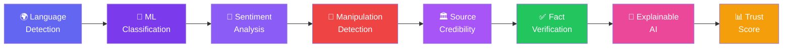

<div align="center">

<!-- Animated Header -->


<!-- Badges Row 1 -->
<p>
  
  
  
  
  
</p>

<!-- Badges Row 2 -->
<p>
  
  
  
  
</p>

<!-- Social Badges -->
<p>
  <a href="#-quick-start"></a>
  <a href="#-7-layer-analysis-pipeline"></a>
  <a href="#-api-reference"></a>
</p>

<br/>


</div>

## 🌟 Overview

<table>
<tr>
<td width="60%">

**FakeDetect AI** is not just a fake news classifier — it's an **Intelligent News Verification Platform** that runs a **7-layer deep analysis pipeline** to determine the authenticity of any news article in real-time.

### ✨ What Makes It Different?

- 🛡️ **7-Layer Pipeline**: Goes far beyond ML prediction with sentiment, manipulation, source, and writing analysis
- 🚨 **Manipulation Scanner**: Detects fear-mongering, clickbait, conspiracy patterns, urgency tactics
- 🔗 **URL Auto-Analysis**: Paste a URL — we scrape the article and analyze the domain's reputation
- 🌍 **45+ Languages**: Auto-detects and translates before analysis
- 🧠 **Explainable AI**: See exactly which words triggered the prediction
- 📄 **Report Generation**: Download comprehensive analysis reports
- ⚡ **Self-Evolving**: Fetches live RSS news and incorporates user feedback to retrain

</td>
<td width="40%">


</td>
</tr>
</table>

---

## 🧠 7-Layer Analysis Pipeline

> **This is the core innovation.** No other tool combines all 7 layers into a single weighted trust score.


```mermaid
graph LR
    A["🌍 Language<br>Detection"] --> B["🤖 ML<br>Classification"]
    B --> C["💭 Sentiment<br>Analysis"]
    C --> D["🚨 Manipulation<br>Detection"]
    D --> E["🏛️ Source<br>Credibility"]
    E --> F["✅ Fact<br>Verification"]
    F --> G["🧠 Explainable<br>AI"]
    G --> H["📊 Trust<br>Score"]

    style A fill:#6366F1,color:#fff
    style B fill:#7c3aed,color:#fff
    style C fill:#8B5CF6,color:#fff
    style D fill:#ef4444,color:#fff
    style E fill:#A855F7,color:#fff
    style F fill:#22c55e,color:#fff
    style G fill:#EC4899,color:#fff
    style H fill:#f59e0b,color:#fff
```

<table>
<tr>
<th>Layer</th>
<th>Feature</th>
<th>What It Does</th>
</tr>
<tr><td>01</td><td><b>🌍 Language Detection</b></td><td>Auto-detects 45+ languages and translates to English for analysis</td></tr>
<tr><td>02</td><td><b>🤖 ML Classification</b></td><td>TF-IDF + Logistic Regression trained on 20,800+ verified articles (98.6% accuracy)</td></tr>
<tr><td>03</td><td><b>💭 Sentiment Analysis</b></td><td>Measures polarity (positive/negative), subjectivity (fact vs opinion), and emotional tone</td></tr>
<tr><td>04</td><td><b>🚨 Manipulation Detection</b></td><td>Scans for 7 manipulation patterns: ALL CAPS, exclamation overuse, fear-mongering, urgency pressure, conspiracy language, clickbait, and us-vs-them framing</td></tr>
<tr><td>05</td><td><b>🏛️ Source Credibility</b></td><td>Cross-references 40+ news outlets for trust scores and political bias ratings</td></tr>
<tr><td>06</td><td><b>✅ Fact Verification</b></td><td>Queries Google Fact Check API against global fact-checkers (Snopes, PolitiFact, etc.)</td></tr>
<tr><td>07</td><td><b>🧠 Explainable AI</b></td><td>Shows exact words that triggered the prediction with TF-IDF × coefficient impact scores</td></tr>
</table>

### 📊 Overall Trust Score

All 7 layers combine into a **weighted composite trust score**:

| Component | Weight | Description |
|-----------|--------|-------------|
| ML Prediction | 45% | Core model confidence |
| Content Credibility | 20% | Sentiment + writing signals |
| Manipulation Safety | 20% | Inverse of manipulation score |
| Writing Quality | 15% | Professionalism metrics |

---

## 🚀 Quick Start

```bash
# 1. Clone the repository
git clone https://github.com/The-ChandanKV/Fake-news-prediction-ML-model.git
cd Fake-news-prediction-ML-model

# 2. Install dependencies
pip install -r requirements.txt

# 3. Train the model (first time only, ~5 min)
python train_improved_model.py

# 4. Run the application
python app.py
```

🎉 Open `http://localhost:5000` in your browser!

---

## 🎮 Live Demo

<div align="center">

### 🔍 Fake News Detection

<table>
<tr>
<td align="center" width="50%">

**Input** 📝

```
"BREAKING: Scientists discover
that drinking coffee makes you
immortal. Government covering
it up for decades! WAKE UP!!!"
```

</td>
<td align="center" width="50%">

**Output** 🛡️

```diff
- ❌ FAKE NEWS
- ML Confidence: 92.1%
- Trust Score: 30/100
- Manipulation: Moderate (4 patterns)
- Writing Quality: Average
```

</td>
</tr>
<tr>
<td>

```
"The Federal Reserve announced
today that it will maintain
current interest rates, citing
stable economic indicators."
```

</td>
<td>

```diff
+ ✅ REAL NEWS
+ ML Confidence: 94.2%
+ Trust Score: 82/100
+ Manipulation: Minimal
+ Writing Quality: Professional
```

</td>
</tr>
</table>

### 🔗 URL Analysis

Paste any URL and the system automatically:
1. Analyzes domain reputation
2. Scrapes article content
3. Runs full 7-layer pipeline

</div>

---

## 📚 API Reference

### Base URL
```
http://localhost:5000
```

### Endpoints

| Method | Endpoint | Description |
|--------|----------|-------------|
| `POST` | `/api/predict` | Full 7-layer analysis pipeline |
| `POST` | `/api/analyze-url` | Dedicated URL analysis |
| `POST` | `/api/feedback` | Submit prediction feedback |
| `POST` | `/api/fetch-news` | Fetch latest news for retraining |
| `POST` | `/api/report` | Generate analysis report |
| `GET` | `/api/trending` | Real-time trending topics analysis |
| `GET` | `/api/stats` | Platform statistics |
| `GET` | `/api/fetch-status` | News fetching status |
| `GET` | `/health` | Health check |

### 🔮 Full Analysis (`POST /api/predict`)

**Request:**
```json
{
    "text": "Your news article text or URL here..."
}
```

**Response:**
```json
{
    "prediction": "Fake News",
    "confidence": 92.1,
    "label": 1,
    "overall_trust_score": 30.2,
    "trust_components": {
        "ml_prediction": 7.9,
        "content_analysis": 36.6,
        "manipulation_inverse": 50.3,
        "writing_quality": 55
    },
    "language": { "detected": "en", "name": "English", "translated": false },
    "content_analysis": {
        "sentiment": { "polarity": 0.0, "subjectivity": 0.0, "label": "Neutral" },
        "manipulation": { "score": 49.7, "verdict": "Moderate Manipulation", "findings": [...] },
        "writing_quality": { "score": 55, "label": "Average", "metrics": {...} }
    },
    "explanation": { "top_words": [...], "fake_indicators": [...] },
    "sources": [...],
    "fact_checks": [...]
}
```

---

## 🎨 Features

<div align="center">

| Feature | Description | Status |
|---------|-------------|--------|
| 🛡️ **7-Layer Pipeline** | Multi-dimensional analysis beyond ML | ✅ Live |
| 🚨 **Manipulation Scanner** | 7 emotional manipulation pattern types | ✅ Live |
| 🔗 **URL Auto-Analysis** | Paste URLs, auto-scrape & analyze | ✅ Live |
| 💭 **Sentiment Analysis** | Polarity, subjectivity, emotional tone | ✅ Live |
| ✍️ **Writing Quality** | Vocabulary richness, readability metrics | ✅ Live |
| 🧠 **Explainable AI** | Word-level coefficient analysis | ✅ Live |
| 🌍 **45+ Languages** | Auto-detect and translate | ✅ Live |
| ✅ **Fact Verification** | Google Fact Check API integration | ✅ Live |
| 🏛️ **Source Credibility** | 40+ outlet trust database | ✅ Live |
| ⚡ **Self-Evolving Model** | RSS feeds + user feedback retraining | ✅ Live |
| 📈 **Trending Dashboard** | Real-time headline analysis | ✅ Live |
| 📄 **Report Generation** | Downloadable HTML analysis reports | ✅ Live |
| 🎬 **Video Background** | Immersive news-themed video | ✅ Live |
| 🪟 **Glassmorphism UI** | Modern frosted glass design | ✅ Live |
| ✨ **Neural Network Viz** | Animated canvas neural network | ✅ Live |

</div>

---

## 📊 Model Performance

<div align="center">

```
┌──────────────────────────────────────────────────────────────┐
│                    MODEL PERFORMANCE                          │
├──────────────────────────────────────────────────────────────┤
│                                                              │
│   Accuracy    ████████████████████████████████████░░  98.6%  │
│   Precision   ██████████████████████████████████████░  97.8% │
│   Recall      █████████████████████████████████████░░  96.2% │
│   F1-Score    ██████████████████████████████████████░  97.0% │
│                                                              │
└──────────────────────────────────────────────────────────────┘
```

</div>

| Parameter | Value |
|-----------|-------|
| Algorithm | Logistic Regression (GridSearchCV tuned) |
| Vectorizer | TF-IDF (20,000 features, bigrams) |
| Training Samples | 20,800+ |
| Test Accuracy | 98.6% |
| Inference Time | <100ms |
| Analysis Pipeline | 7 layers |

---

## 🛠️ Tech Stack

<div align="center">

### Backend
<p>


</p>

### Frontend
<p>


</p>

### APIs & Data
<p>


</p>

</div>

---

## 📁 Project Structure

```
FakeDetect-AI/
│
├── 📂 model/
│   ├── 🤖 fake_news_model.pkl           # Trained ML model
│   └── 📊 tfidf_vectorizer.pkl          # TF-IDF vectorizer
│
├── 📂 static/
│   ├── 🎨 styles.css                     # Glassmorphism + responsive CSS
│   ├── ⚡ script.js                      # Neural net animation + analysis display
│   └── 📂 video/
│       └── 🎬 news_intro.mp4            # Background video
│
├── 📂 templates/
│   └── 🌐 index.html                    # Main HTML (7-layer UI)
│
├── 🐍 app.py                            # Flask app + 7-layer API pipeline
├── 🧠 advanced_features.py              # Language, fact-check, source, explainability
├── 💭 sentiment_analysis.py             # Sentiment + manipulation + writing quality
├── 🔗 url_analysis.py                   # URL credibility + scraping
├── 📰 fetch_news.py                     # Dynamic news fetcher (RSS/APIs)
├── 🔬 train_improved_model.py           # Model training with GridSearchCV
├── 🧪 test_model.py                     # Model testing script
├── 📋 requirements.txt                  # Python dependencies
├── 📚 README.md                         # This file!
└── 📊 train.csv                         # Training dataset (20,800+)
```

---

## 🤝 Contributing

We love contributions! Check [Issues](../../issues) for bugs or feature requests.

```bash
# Fork → Clone → Branch → Commit → Push → PR
git checkout -b feature/amazing-feature
git commit -m "Add amazing feature"
git push origin feature/amazing-feature
```

---

## 💖 Support

<div align="center">

<a href="https://github.com/The-ChandanKV/Fake-news-prediction-ML-model/stargazers">
  
</a>
<a href="https://github.com/The-ChandanKV/Fake-news-prediction-ML-model/fork">
  
</a>

</div>

---

<div align="center">

## 🙏 Acknowledgments

<table>
<tr>
<td align="center">

<br/>Python
</td>
<td align="center">

<br/>Flask
</td>
<td align="center">

<br/>Scikit-learn
</td>
<td align="center">

<br/>JavaScript
</td>
<td align="center">

<br/>CSS3
</td>
</tr>
</table>

---

### 📬 Contact

<p>
<a href="mailto:thechandankv@gmail.com">
  
</a>
</p>

---

**Presented at AIKYAM 2026 — National Level IPR Conclave, RVITM Bengaluru**


</div>
